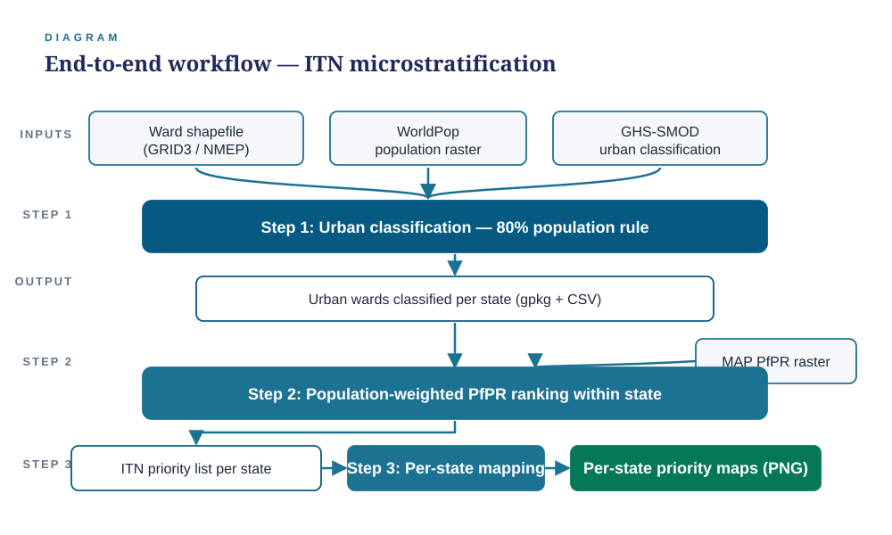

# Nigeria ITN Urban Microstratification

A ward-level workflow for prioritizing insecticide-treated net (ITN) distribution
in Nigeria, combining an **80% urban population rule** with **PfPR (malaria
parasite prevalence) ranking** to identify which urban wards should receive
nets and which are lower priority.

Built for NMEP (National Malaria Elimination Programme) HBHI 2026
post-hoc stratification.

## Why

ITN campaigns traditionally distribute nets at LGA (district) level. In
rapidly urbanizing states, this over-nets low-transmission urban cores while
under-resourcing high-transmission peri-urban/rural fringes. This workflow
pushes the decision down to the **ward** level and adds two layers of nuance
that a flat urban/rural split misses:

1. Not every "urban" ward has low transmission — some still have moderate/high PfPR.
2. Even a correctly prioritized ward may be operationally hard to reach.

## Workflow



| Step | Script | What it does |
|---|---|---|
| 1 | `scripts/01_create_urban_wards.R` | Classifies each ward as **Urban** or **Rural** using the population-weighted share of urban pixels (GHS-SMOD ≥ 21) inside the ward polygon. A ward is **Urban** if ≥ **80%** of its population sits in urban-classified pixels. |
| 2 | `scripts/02_pfpr_ranking_itn_priority.R` | Extracts population-weighted mean PfPR per ward (MAP/INLA raster), bands it into WHO/NMEP endemicity categories (very low / low / moderate / high), and ranks urban wards by PfPR within each state. |
| 2b | `scripts/02_pfpr_ranking_itn_priority_unweighted.R` | Sensitivity variant of step 2 — same logic, but PfPR is a simple areal mean (no population weighting), and prioritization also checks the top-80%-by-rank cutoff within state. |
| 3 | `scripts/03_map_itn_priority.R` / `03_map_itn_priority_unweighted.R` | Renders one map per state showing which urban wards are prioritized vs. deprioritized; rural wards are shown as muted background context. |
| 4 | `scripts/04_operational_feasibility_accessibility.R` | Takes only the wards flagged *"Prioritized (urban moderate/high PfPR)"* and overlays travel time to the nearest city (MAP/Weiss accessibility raster) to assign a deployment feasibility tier. |
| 5 | `scripts/05_map_itn_feasibility.R` | Maps deployment tier and travel time per state, plus a national overview of prioritized urban wards by tier. |

### Prioritization rule

```
Rural ward                                  -> Prioritized (rural), always
Urban ward, PfPR category moderate/high      -> Prioritized (urban moderate/high PfPR)
Urban ward, PfPR category very low/low       -> Deprioritized (urban very-low/low PfPR)
```

PfPR endemicity bands (population-weighted mean PfPR, ages 2-10):

| Band | Range |
|---|---|
| Very low | < 1% |
| Low | 1–10% |
| Moderate | 10–35% |
| High | > 35% |

## Repo layout

```
scripts/    R scripts, run in numeric order (01 -> 05)
docs/       Workflow diagram (editable SVG) and abstract write-ups
figures/    A curated sample of output maps (priority + feasibility), by state
```

## Inputs (not included in this repo)

The scripts expect the following under a local `data/` directory (paths are
set at the top of each script and will need to be updated to your environment):

- `shapefiles/` — state, LGA, and ward boundaries (GRID3 / NMEP)
- `population/allage_population_2025.tif` — WorldPop 2025 all-age population
- `urban_extent/ghs_smod.tif` — GHSL Settlement Model (urban classification)
- `malaria/pfpr_INLA_mean.tif` — MAP/INLA modelled PfPR
- `accessibility/accessibility_to_cities_2015.tif` — MAP/Weiss travel time to nearest city

These rasters are large (multi-GB) and not versioned here; see the header
comment in each script for the exact expected path and source.

## Requirements

```r
install.packages(c("sf", "terra", "tidyverse", "exactextractr", "ggspatial", "scales"))
```

## Outputs

Each script writes a national `.gpkg` (all wards + attributes) and per-state
CSVs, so results can be reviewed either in GIS or in a spreadsheet. See the
header comment of each script for the exact output paths.

## Status

Prepared as part of NGA ITN Urban Microstratification (HBHI 2026 post-hoc
analysis); presented at ASTMH (see `docs/`).
